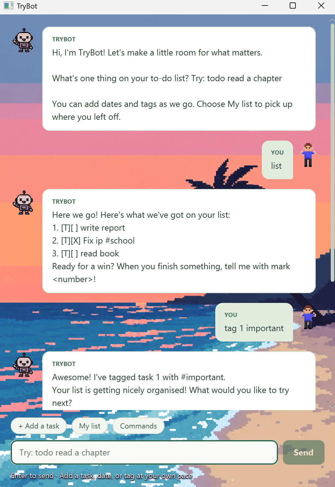

# TryBot User Guide

TryBot is a friendly desktop chatbot for managing your tasks. Type commands in the chat window to add tasks, track progress, search your list, and keep your plans organised.



## Getting started

1. Start TryBot from IntelliJ by running `TryBot.main()`, or run the executable JAR from a command window.
2. Type a command in the input box and submit it.
3. Type `help` at any time to display the complete command list.
4. Type `bye` when you are finished.

Commands are not case-sensitive, and spaces before or after a command are ignored. Task numbers are the numbers shown by `list`.

## Adding tasks

### To-do tasks

Use a to-do task for something that needs to be done but has no specific time.

```text
todo <description>
```

Example:

```text
todo read chapter 3
```

### Deadlines

Use a deadline when a task must be completed by a particular date or time.

```text
deadline <description> /by <date or time>
```

Examples:

```text
deadline submit report /by Friday
deadline return book /by 2026-12-01
deadline deploy project /by 1/12/2026 1800
```

TryBot accepts descriptive values such as `Friday`, as well as numeric dates in `yyyy-MM-dd`, `d/M/yyyy`, or `d-M-yyyy` format. Add a time as `HHmm` or `HH:mm`.

### Events

Use an event for something with a start and end time.

```text
event <description> /from <start> /to <end>
```

Examples:

```text
event project meeting /from Monday /to Tuesday
event study session /from 2026-12-03 0900 /to 3/12/2026 1030
```

An event must include both `/from` and `/to`, and its end must not be earlier than its start when numeric dates or times are used.

## Viewing and finding tasks

Show every task in the current list:

```text
list
```

Find tasks whose descriptions contain a keyword:

```text
find <keyword>
```

Example:

```text
find report
```

Search is case-insensitive and keeps the original task order. The search checks task descriptions, not deadline or event details.

## Updating tasks

Use the task number shown by `list`.

| Command | What it does | Example |
| --- | --- | --- |
| `mark <number>` | Marks a task as done | `mark 1` |
| `unmark <number>` | Marks a task as not done | `unmark 1` |
| `delete <number>` | Deletes a task | `delete 1` |
| `tag <number> <name>` | Adds a tag to a task | `tag 1 urgent` |
| `tagdel <number>` | Removes all tags from a task | `tagdel 1` |

Tags appear beside the task in the list. For example:

```text
tag 1 school
list
```

## Other commands

| Command | What it does |
| --- | --- |
| `help` | Shows all supported commands and their usage |
| `bye` or `bye!` | Ends the TryBot session |

## Saving your tasks

TryBot automatically saves successful task-list changes. When you start TryBot again, it loads the saved tasks from `data/trybot.txt` relative to the folder where the application is run.

If the saved task file cannot be loaded, TryBot starts with an empty list and displays a warning. Keep the `data` folder with the JAR if you want your tasks to persist between sessions.

## Troubleshooting

- Use `list` to check task numbers before using `mark`, `unmark`, `delete`, `tag`, or `tagdel`.
- A task description cannot be empty. For example, use `todo buy groceries`, not just `todo`.
- A deadline needs both a description and `/by` value.
- An event needs a description, `/from` value, and `/to` value.
- Numeric dates must be real calendar dates, and times must use a valid 24-hour value.
- If TryBot does not recognise a command, enter `help` to see the supported spelling and format.
